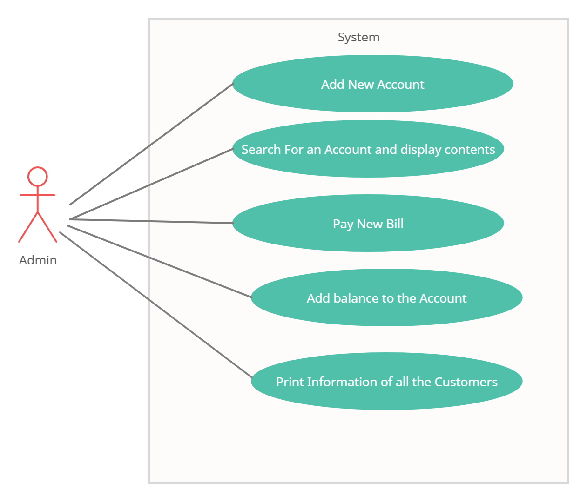

# Requirements
## Introduction
* The growth in business also lead to the growth in the need of E-billing applications where all the information regarding the customer transanctions in that departmental store can be maintained online.
* Cutomer Billing System is a console based application where a customer can create and maintain an account. This account contains all the information of the customer and also the account can be edited as and when required.

## Customer Billing System Features

The main aim of Customer Billing System is to maintain the information and payment history of the customer.It has the capacity to illustrate and analyze the basic billing system and the main functionalities that surround the billing system from a business prospective and explains how each interacts to complete the billing cycle.
It capable of billing more quickly, accurately and update customer record and enables customer to view bill information.

### Services Offered to the Customers
* A customer can create an account for his own and give his details such as address to be stored.
* This helps the store to provide home delivery to the customer.
* The billing history of the customer is maintained.
* The customer can maintain some amount as balance to pay cash less as and when required in any brach of that departmental store.
* The customer can edit the information in his account as and when required.

### Services
Service is the entity offered by the company and targeted to the customers.

### Accounts
The customer account includes customer contact, profile information, account number, city and balance amount in the account.

### Payments
Each customer in the system has an account balance, which affects any invoices requested by the customer and any payments done by the customer.

## Cost and Features

## System Definition

### Integration
The Customer Billing System interacts with :
  * Banking applications
  

